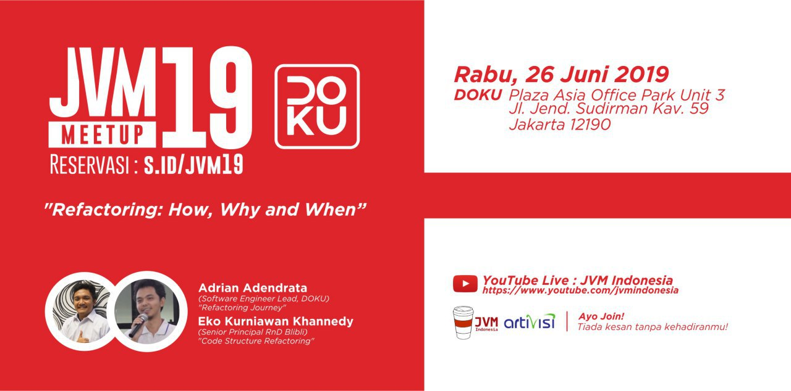
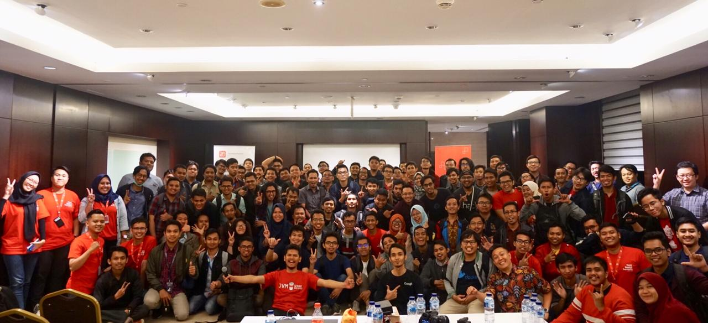

# JVM-Meetup-19
Summarize from JVM Meetup #19 @ DOKU 

PT. Nusa Inti Arta

Plaza Asia Office Park Unit 3

Jl. Jend. Sudirman Kav. 59 Jakarta 12190

Speaker : 

1. Adrian Adendrata (Software Engineer Lead, DOKU) - ["Refactoring Journey"](https://drive.google.com/open?id=1c7chbaEMbX2oI_U-LxS_R43RtNfnwpsZ)
2. Eko Kurniawan Khannedy (Senior Principal RnD Blibli) : ["Code Structure Refactoring"](https://drive.google.com/open?id=1HMZadMI1flTgHjZU8j-PbrHl1oaG8lOs)

## JVM MEETUP 19 PHOTO SESSION

Ayo join JVM User Group di telegram untuk diskusi lebih lanjut.

Join Us : [@JVMUserGroup](https://t.me/JVMUserGroup)

Like & Follow Instagram : [JVM Indonesia](https://www.instagram.com/jvmindonesia/)

Like & Follow : [JVM Developer ID](https://www.facebook.com/JVMDeveloperID/)

Subscribe : [JVM Indonesia](https://www.youtube.com/channel/UCXwXmQEQySqhqAMmys4N56w)